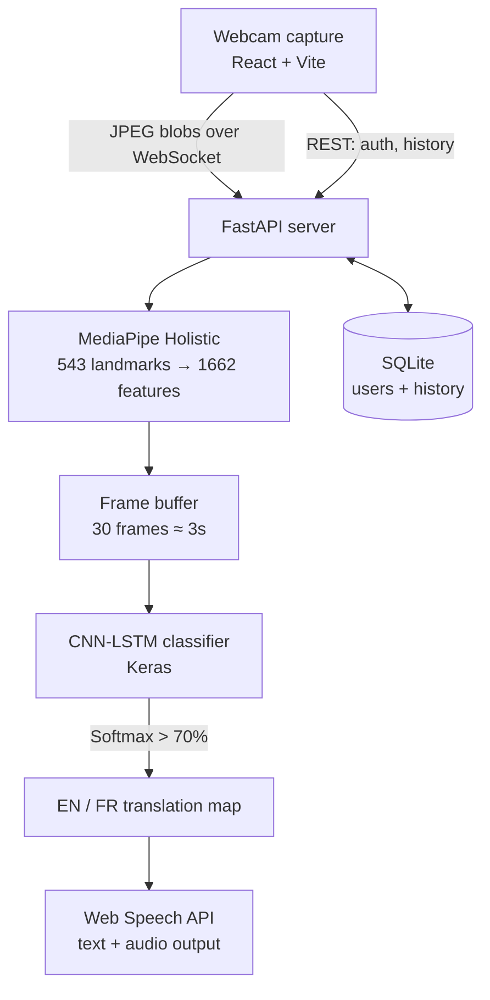

# SignSpeak

**Real-time American Sign Language translation in the browser — gesture to text and speech, in English and French.**

[Live demo](https://signspeak2.vercel.app) · Built with MediaPipe Holistic + TensorFlow LSTM + FastAPI + React

<!-- REPLACE THIS LINE with your demo GIF:    -->

---

## The problem

Sign language is the native tongue of deaf and non-verbal people, yet under 1% of the hearing population understands it. In hospitals, schools, courts and government offices this becomes a hard barrier — and human interpreters are scarce and expensive.

SignSpeak captures ASL gestures from any basic webcam, extracts skeletal landmarks, classifies the movement sequence with a recurrent neural network, and speaks the result aloud — with no specialised hardware.

## How it works



## Stack and decisions

| Component | Technology | Why |
|---|---|---|
| Frontend | React (Vite) + CSS3 | Fast rendering, webcam capture, glassmorphism dark UI |
| Transport | WebSockets + REST | WebSockets stream frames full-duplex; REST handles auth and history |
| Speech | Web Speech API | Native client-side TTS, EN + FR locales — zero server cost |
| Backend | FastAPI | Async Python, auto OpenAPI docs, low router overhead |
| Auth | JWT + bcrypt | Token sessions, hashed credentials |
| Database | SQLite + SQLAlchemy | Persistent translation history and user accounts |
| Features | MediaPipe Holistic | 543 real-time 3D landmarks (pose, face, both hands) |
| Classifier | CNN-LSTM (Keras) | Classifies joint trajectories over time |

## The deep learning pipeline

### 1. Feature extraction

Rather than feeding raw pixels to the network, MediaPipe Holistic extracts per frame:

- **33 pose landmarks** — body skeleton in `(x, y, z)` + visibility
- **468 face landmarks** — facial mesh for expression
- **21 landmarks per hand** — finger joints in 3D

Concatenated into a flat `(1, 1662)` array.

**Why landmarks over pixels:** the model never sees background, clothing colour or lighting — only skeletal geometry, so it generalises across environments. It's also ~550× smaller than a 640×480 frame (1,662 floats vs 921,600).

### 2. Sequence classification

A still image can't define a sign — "Hello" is *movement*.

1. Frontend streams at 10 FPS; backend buffers exactly **30 frames** (≈3 seconds)
2. The `(30, 1662)` matrix goes into a multi-layer LSTM
3. Memory cells carry earlier trajectory forward through the sequence
4. Softmax over the sign library; predictions above **70% confidence** are translated

```
Input: (30 frames × 1662 features)
   ↓
LSTM(64) → BatchNorm → Dropout(0.3)
   ↓
LSTM(128) → BatchNorm → Dropout(0.3)
   ↓
Dense(64, ReLU) → Dropout(0.5)
   ↓
Dense(N_classes, Softmax)
```

## Bilingual output

Recognised signs map to English or French text through a built-in dictionary, then speak through the matching TTS locale (`en-US` / `fr-FR`) with native phonetics. This matters in Cameroon, where both are official languages.

## Engineering notes

**Bandwidth.** Frames are drawn to an offscreen canvas and compressed to 60%-quality JPEG binary blobs before streaming. This cuts bandwidth by over 90% and keeps end-to-end latency under 40 ms.

**Development fallback.** `inference.py` detects whether `tensorflow`, `mediapipe` and `cv2` are importable. If they aren't, it runs a stub inference path so the WebSocket transport, frame buffering and UI can be developed and tested without the ML stack installed — useful in CI and on low-spec machines. **Production and the live demo always run the trained model**; the stub exists only so the plumbing can be worked on independently of the model.

## Running locally

**Backend**
```bash
cd backend/
pip install -r requirements.txt
uvicorn main:app --reload --host 127.0.0.1 --port 8000
```
API docs at `http://127.0.0.1:8000/api/docs`

**Frontend**
```bash
cd frontend/
npm install
npm run dev
```
Open `http://localhost:5173`

## Limitations

- Vocabulary is limited to the signs in the trained library — this is a proof of concept, not a full interpreter
- One-way only: sign → text/speech
- Requires reasonable lighting and the signer's upper body in frame
- Trained on a self-collected dataset; accuracy on unseen signers is unverified

## Roadmap

**Two-way communication.** The clear next step is a return path:

- **Speech-to-text** — capture the hearing user's speech
- **NLP translation** — restructure it into ASL Gloss syntax
- **3D avatar** — render the signs back via a WebGL/Three.js avatar

That would close the loop into a bi-directional virtual interpreter, so the deaf user no longer has to read text.

## Acknowledgements

Final-year capstone project, University of Buea, College of Technology.
Supervised by Mr. Nkome.

## Licence

MIT — see [LICENSE](LICENSE).
