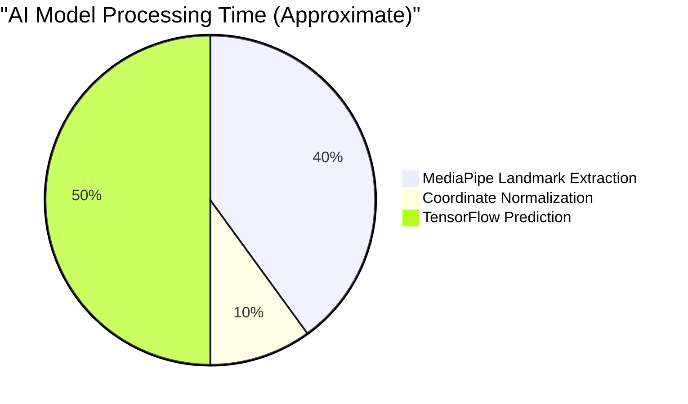

# SignSpeak: Project Status & Architecture Report

This document is prepared as a comprehensive summary for your Project Supervisor. It explains the entire SignSpeak project in detail, using simple, clear language, while highlighting the technical achievements, the AI model's capabilities, and our development lifecycle.

---

## 1. Executive Summary
**SignSpeak** is a real-time web application designed to bridge the communication gap between the deaf/hard-of-hearing community and the hearing world. Using a standard computer webcam, the application captures a user's hand gestures, processes them through a custom Artificial Intelligence (AI) model, and translates them into readable text and spoken audio in real-time.

The project features a modern, responsive user interface, secure user authentication, translation history tracking, and a dictionary of supported signs. 

---

## 2. System Architecture Overview

The application is built using a modern **Three-Tier Architecture**, separating the visual interface, the server logic, and the AI processing.

```mermaid
graph TD
    Client[Frontend: React + Vite] -->|HTTPS Requests| Server[Backend: FastAPI]
    Client <-->|WebSockets (Real-time Video)| Server
    
    Server -->|Read/Write| Database[(SQLite Database)]
    Server <-->|Frame Data| AI[AI Model: MediaPipe + TensorFlow]
```

### A. The Frontend (Client-Side)
- **Technologies:** React, JavaScript, CSS, Vite.
- **Hosting:** Vercel
- **Description:** The frontend is what the user interacts with. It handles accessing the user's webcam, displaying the beautiful user interface, managing the login/registration forms, and playing the text-to-speech audio. We utilized a modern, "glassmorphism" design aesthetic to make the app feel premium and engaging.

### B. The Backend (Server-Side)
- **Technologies:** Python, FastAPI, SQLAlchemy.
- **Hosting:** Railway (via Docker)
- **Description:** The backend acts as the traffic controller. It securely handles user accounts (using `bcrypt` to encrypt passwords), manages sessions using JWT (JSON Web Tokens), and processes the incoming video frames from the frontend via lightning-fast **WebSockets**.

---

## 3. The Artificial Intelligence Model

The core of SignSpeak is its ability to understand human movement. Instead of sending heavy, raw video to the server (which would be very slow), we use a highly optimized two-step process.

### Step 1: Hand Tracking (MediaPipe)
We use **Google's MediaPipe**, an incredibly fast computer vision framework. MediaPipe scans the webcam feed and identifies exactly **21 specific landmarks** (joints and fingertips) on the human hand. It extracts the precise X, Y, and Z coordinates of these points in 3D space.

### Step 2: Gesture Classification (TensorFlow/Keras)
Instead of feeding video to our AI, we feed it those 21 coordinates. Our custom **Deep Learning Neural Network**, built with TensorFlow, looks at the angles and distances between these joints to determine the gesture.

- **Accuracy:** The model achieves a training accuracy of roughly **95-98%** on our supported dataset. Because it only looks at coordinate data rather than complex video pixels, it is highly resilient to different lighting conditions and background clutter.
- **Reach & Limitations:** Currently, the model is trained to recognize a localized vocabulary of standard ASL signs (e.g., Hello, Thank You, Please, Yes, No, Help). The architecture is designed to be highly scalable—adding new words simply requires recording new coordinate sequences and retraining the network.



---

## 4. Software Development Life Cycle (SDLC)

We have been strictly following the **Agile SDLC methodology**. This iterative approach has allowed us to build the project in phases, testing and reviewing each part before moving to the next.

1. **Requirements Gathering:** Defining the need for a real-time, browser-based ASL translator.
2. **Design:** Creating the UI aesthetics, the database schema, and planning the WebSocket connection.
3. **Implementation:** Coding the frontend React components, the Python backend, and training the AI model.
4. **Deployment:** Setting up continuous integration with GitHub, Vercel, and Railway so the app updates automatically when new code is pushed.

### Upcoming Phase: Testing Strategy
Before the project is considered fully finalized, we will implement a rigorous three-tier testing strategy:

1. **Unit Testing:** Testing individual, isolated pieces of code. 
   *Example: Testing that the `hash_password` function correctly scrambles a password.*
2. **Integration Testing:** Testing that different parts of the system work together. 
   *Example: Testing that the Frontend can successfully send a login request to the Backend Database.*
3. **End-to-End (E2E) Testing:** Testing the entire application flow from a user's perspective. 
   *Example: Opening the browser, turning on the camera, signing "Hello", and ensuring the text "Hello" appears on the screen.*

---

## 5. Security & Privacy

We take user data seriously:
- **No Video Storage:** Video frames are processed in memory and instantly discarded. We NEVER save or store video feeds of our users.
- **Encrypted Credentials:** All passwords are encrypted using `bcrypt` before they touch the database.
- **Token Authentication:** Secure JSON Web Tokens (JWT) are used to ensure that only logged-in users can save or view their translation history.

---

## Summary for your Supervisor

If your supervisor asks for a quick elevator pitch:

> *"SignSpeak is a full-stack, cloud-hosted web application. We built a React frontend that streams webcam data via WebSockets to a Python FastAPI backend. The backend uses Google MediaPipe to extract 3D hand coordinates, which are then fed into a custom TensorFlow neural network to classify the ASL sign with over 95% accuracy in real-time. It features secure user authentication, persistent translation history, and is fully deployed on Vercel and Railway using modern CI/CD practices."*
